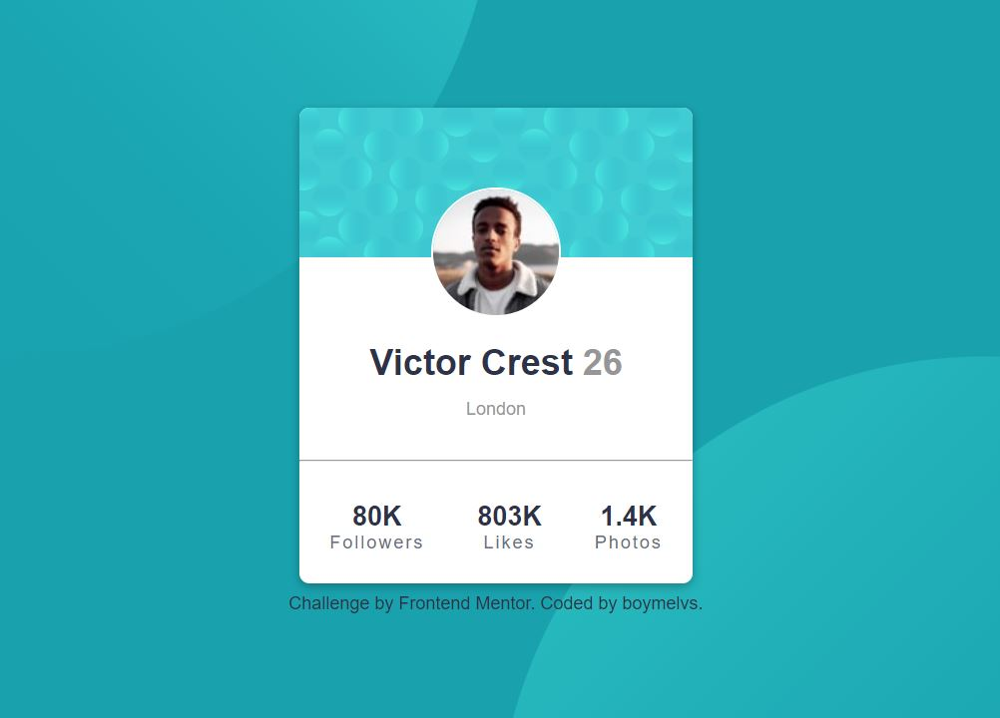

# Frontend Mentor - PROFILE CARD COMPONENT SOLUTION

## Table of contents

- [Overview](#overview)
  - [The challenge](#the-challenge)
  - [Screenshot](#screenshot)
  - [Links](#links)
- [My process](#my-process)
  - [Built with](#built-with)
- [Author](#author)

## Welcome! 👋

Thanks for checking out this front-end coding challenge.

## Overview

This is a solution to the [Profile card component challenge on Frontend Mentor](https://www.frontendmentor.io/challenges/profile-card-component-cfArpWshJ). Frontend Mentor challenges help you improve your coding skills by building realistic projects.

### The challenge

Users should be able to:

- Design Profile card component
- Build out the project to the designs provided

### Screenshot

### Links

- Solution URL: [My Solution](https://github.com/boymelvs/PROFILE-CARD-COMPONENT.git)
- Live Site URL: [Live site](https://boymelvs.github.io/PROFILE-CARD-COMPONENT/)

### Built with

- HTML
- Flexbox
- CSS

## Author

- Frontend Mentor - [@boymelvs](https://www.frontendmentor.io/profile/boymelvs)
